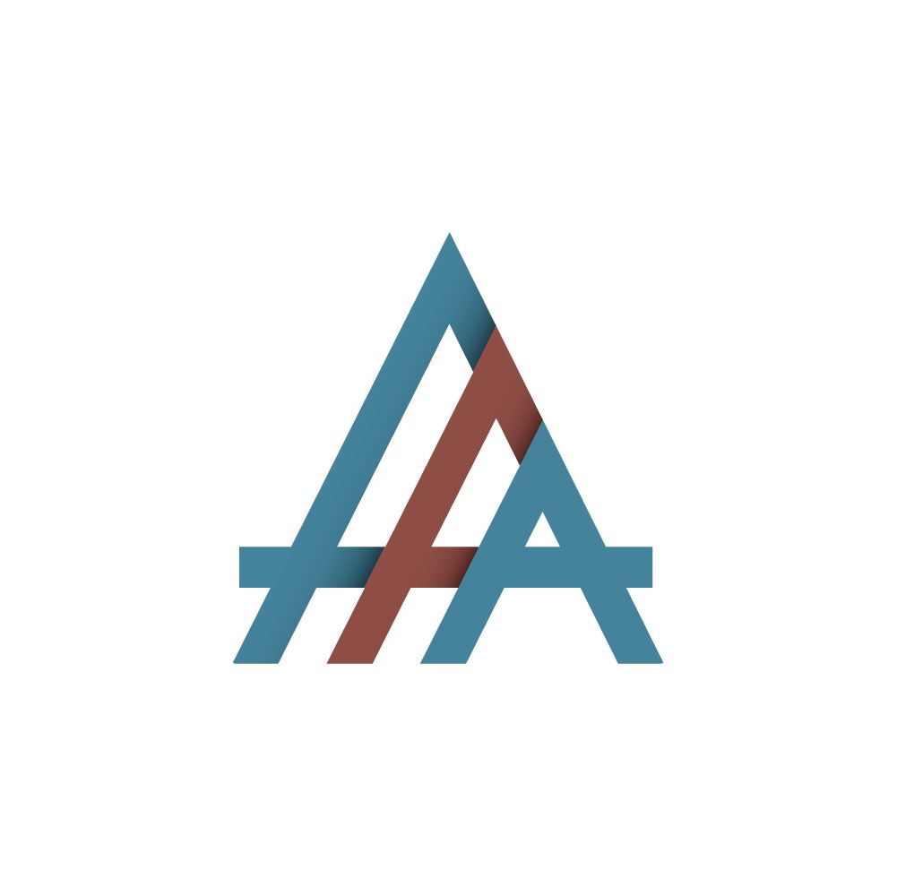

#  *Agile  Associates Anonymous*

#### [UFCF85-30-3 -Enterprise-systems-development](https://github.com/19ATF77/AAA-documentation)

***
### Group members :shipit:
- **Lead Testers:**   
  - George Greenfield - **17025822**
  - James Jeremiah - **17042447**
- **Lead Developers:**  
  - Micah Hobby - **17027531**
  - Robert Barclay - **17043773**
- **Technical Lead:**  
   - Rodrigo Sanchez - **17044007**

### Key Dates :date:
- **Date established -** *2020-09-21* :tada:
- **Date dissolved -** *TBA* :broken_heart:

### Project Milestones :passport_control:
- **First draft deadline:**
- **Second draft deadline:**
- **Final review deadline:**

### Meetings conducted :notebook:
- **Project Roles & Team structure -** *2020-09-21*
- **Discussion on workflows & technologies -** *2020-09-21*

### Technologies Used :computer:
- Trello
- Github
- Netbeans 9.2 | V.S.Code

### Coding Standards :white_check_mark:
- [Doxygen Standard](https://www.doxygen.nl/manual/docblocks.html)
***
Updated *2020-09-21*
